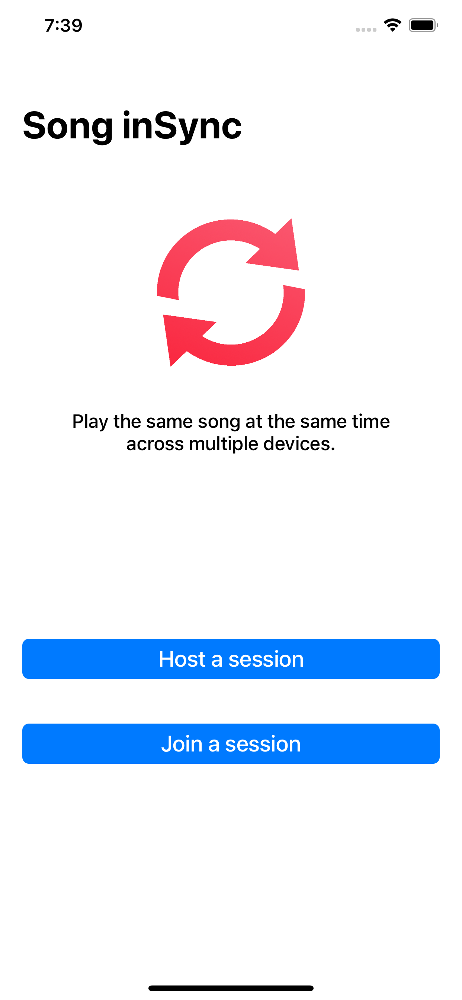
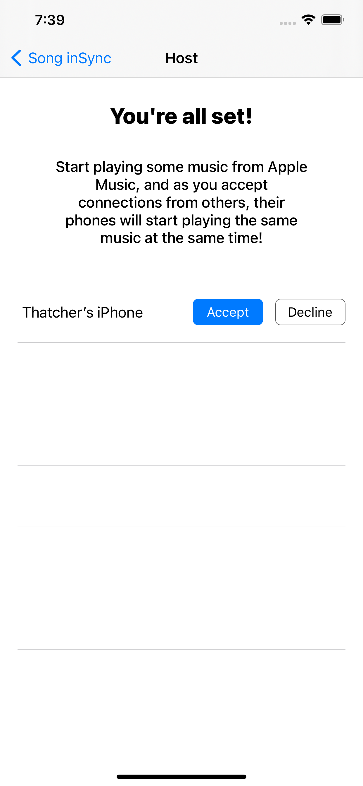
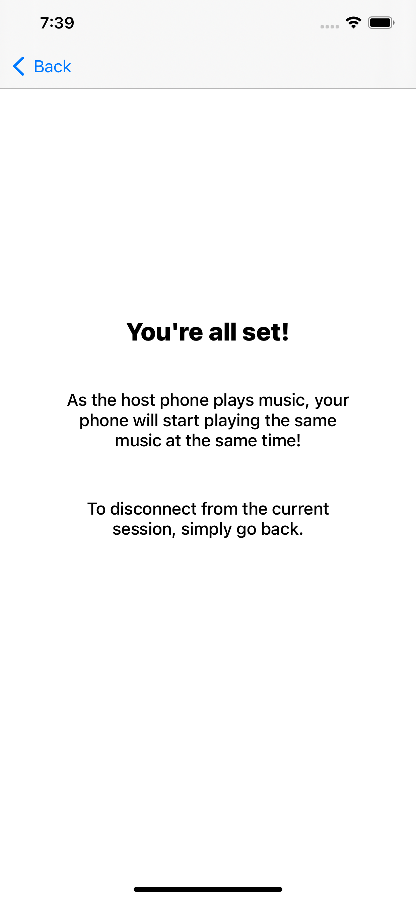

# Song inSync
Song inSync is an iOS app that lets you to play the same song at the same time across multiple devices.

## Screenshots
Home|Hosting|Joined
:-------------------------:|:-------------------------:|:-------------------------:
||

## How it works
Song inSync operates using a host / client based connection.
The host can accept or decline incoming connections from clients, and as the host plays music, accepted clients play the same music at the same time.

Song inSync achieves this by sending the current playing song, the current position in the song, and the current time to the client.
With this information the client can play the same song at the same time.

Song inSync is only compatible with Apple Music.

Note: While this project will compile, it will not run properly because an Apple Music API key is required when running ``pod install``. 
Instruction for obtains this key can be found [here](https://developer.apple.com/documentation/applemusicapi/getting_keys_and_creating_tokens). 
In addition to following those instructions, I also used [this python program](https://github.com/pelauimagineering/apple-music-token-generator) to generate the key after gathering the necessary information. 

## Installation
Song inSync can be installed from the [App Store](https://apps.apple.com/us/app/song-insync/id1522047990).

## License
[MIT](https://choosealicense.com/licenses/mit/)

Copyright 2020 © ThatcherDev.